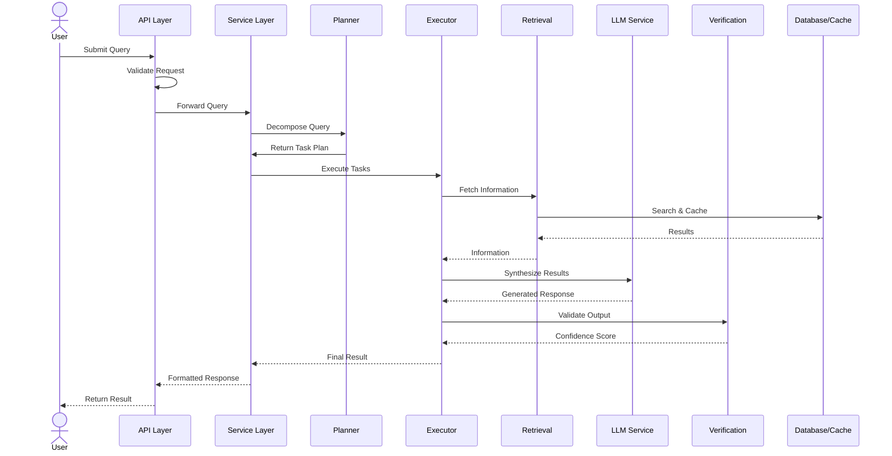

# Architecture Guide

## System Overview

CAARA is built with a layered architecture that separates concerns across multiple logical layers:

```
┌─────────────────────────────────────────────────┐
│              API Layer                          │
│  (Routes, Controllers, Middleware)              │
└─────────────────────┬───────────────────────────┘
                      │
┌─────────────────────▼───────────────────────────┐
│           Service Layer                         │
│  (Business Logic & Orchestration)               │
└─────────────────────┬───────────────────────────┘
                      │
        ┌─────────────┼─────────────┐
        │             │             │
┌───────▼──┐  ┌──────▼───┐  ┌─────▼───────┐
│  Planner  │  │ Executor │  │ Retrieval   │
│  Module   │  │  Engine  │  │  System     │
└───────────┘  └──────────┘  └─────────────┘
        │             │             │
        └─────────────┼─────────────┘
                      │
┌─────────────────────▼───────────────────────────┐
│       Data Access Layer                         │
│   (Repositories, ORM)                           │
└─────────────────────┬───────────────────────────┘
                      │
    ┌─────────────────┼─────────────────┐
    │                 │                 │
┌───▼────┐    ┌──────▼────┐    ┌──────▼────┐
│ Cache  │    │ Database  │    │  Message  │
│(Redis) │    │(PostgreSQL)    │  Queue    │
└────────┘    └───────────┘    └───────────┘
```

## Key Components

### API Layer

Handles all HTTP request/response processing.

**Responsibilities:**

- Request validation
- Error handling
- Response serialization
- Middleware orchestration

**Key Files:**

- `src/api/routes/` - Route definitions
- `src/api/controllers/` - Request handlers
- `src/api/middleware/` - Custom middleware

### Service Layer

Implements business logic and coordinates operations across modules.

**Responsibilities:**

- Query processing coordination
- Service orchestration
- Business rule enforcement
- Transaction management

**Key Files:**

- `src/services/` - Service implementations
- `src/utils/` - Utility functions and helpers

### Planner Module

Decomposes complex queries into executable tasks.

**Responsibilities:**

- Query analysis
- Task decomposition
- Dependency graph creation
- Execution plan optimization

**Key Files:**

- `src/agents/planner.ts` - Planning logic
- `src/agents/memory.context.ts` - Context management

### Executor Engine

Orchestrates execution of decomposed tasks.

**Responsibilities:**

- Task execution
- Dependency resolution
- Error recovery
- Execution monitoring

**Key Files:**

- `src/agents/executor.ts` - Execution orchestration
- `src/agents/tools/` - Tool implementations

### Retrieval System

Hybrid search combining semantic and lexical ranking.

**Responsibilities:**

- Vector similarity search
- Keyword-based search
- Result reranking
- Source tracking

**Key Files:**

- `src/retrieval/hybrid.retriever.ts` - Orchestration
- `src/retrieval/vector.store.ts` - Vector search
- `src/retrieval/keyword.search.ts` - Keyword search
- `src/retrieval/reranker.ts` - Result reranking

### Verification Engine

Validates and scores output quality.

**Responsibilities:**

- Output validation
- Confidence scoring
- Quality metrics
- Error detection

**Key Files:**

- `src/verification/verifier.ts` - Verification logic
- `src/verification/confidence.scorer.ts` - Scoring

### Data Access Layer

Provides abstraction for data operations.

**Responsibilities:**

- Database queries
- Data mapping
- Transaction handling
- Query optimization

**Key Files:**

- `src/db/repositories/` - Repository pattern implementation
- `prisma/schema.prisma` - Database schema

### Cache Layer

Distributed caching for performance optimization.

**Responsibilities:**

- Query result caching
- Session management
- Cache invalidation
- TTL management

**Key Files:**

- `src/cache/redis.client.ts` - Redis client

### Message Queue

Background job processing and async operations.

**Responsibilities:**

- Background job scheduling
- Task distribution
- Failure handling
- Job monitoring

**Key Files:**

- `src/queues/queue.ts` - Queue setup
- `src/queues/worker.ts` - Worker implementation

## Data Flow

The following diagram illustrates how a query flows through the system:



**Step-by-step breakdown:**

1. **User Query** - Client submits a query via REST API
2. **Request Validation** - API layer validates format and parameters
3. **Service Orchestration** - Service layer coordinates all operations
4. **Query Decomposition** - Planner decomposes complex query into sub-tasks
5. **Task Execution** - Executor runs tasks with dependency resolution
6. **Information Retrieval** - Retrieval system fetches relevant sources
7. **Result Synthesis** - LLM generates answers from retrieved information
8. **Output Verification** - Verification engine validates and scores results
9. **Response Formatting** - System prepares final response
10. **Client Response** - API returns result to user

## Technology Decisions

### TypeScript

- Provides type safety and better IDE support
- Improves code maintainability and readability
- Enables better refactoring with compiler checks

### Express.js

- Lightweight and flexible HTTP framework
- Well-established ecosystem
- Supports middleware pattern for composable request handling

### PostgreSQL

- Reliable relational database
- Strong consistency guarantees
- Excellent performance for structured data

### Prisma ORM

- Type-safe database access
- Automatic migrations
- Strong TypeScript support
- Prisma Studio for data management

### Redis

- High-performance caching
- Session management
- Pub/Sub messaging capabilities
- Distributed caching for scalability

### BullMQ

- Reliable job queue system
- Built on Redis
- Job persistence and recovery
- Advanced scheduling capabilities

## Performance Considerations

### Caching Strategy

- Query results cached in Redis with configurable TTL
- Cache key generation based on query and context
- Automatic cache invalidation on data updates

### Database Optimization

- Proper indexing on frequently queried columns
- Connection pooling via Prisma
- Query optimization through explain plans

### Async Processing

- Background jobs for long-running operations
- Task queue for scalability
- Failure handling and retries

### Retrieval Optimization

- Vector search with dimensionality reduction
- Result pagination for large result sets
- Caching frequently accessed embeddings
